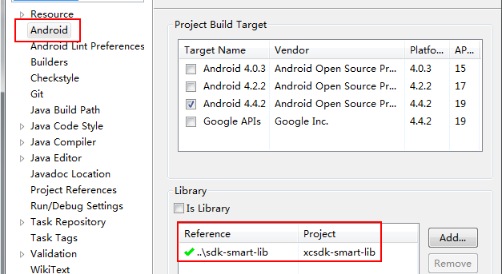

This is the Xiaocong SDK.

## Feature

* Xiaocong advertisement and pushing service.
* Xiaocong User/Account system service.
* Xiaocong Payment SDK.

> Tip
* Our SDK is designed for TVs, which have higher resolution than mobile phones. We expect the resolution 1280px * 960px at least.
* Almost all android TVs in the market carry Android 4.0+. So we need `minSdkVersion > 14` .

## Quick Start

We provide you with an Eclipse Android Library Project. Add this project as your project's dependency project.

Also copy all libs in `libs` of the library project to your project's `libs`.

You may need ask for developer id/key before running some functions. Please refer to [doc](./doc).

## Change Logs

### Version 0.9.1

2014-05-28
Improve payemnt flow; Support 360 payment.

1. The payment flows have been improved. `PaymentStartActivity` and `PayWayActivity` are merged into a single activity `PaymentActivity_`.
1. The Payment Test DEMO has been simplified. You could start the payment test with a single button.
1. We now take care of checking user account when needed. You don't need to care for user authenciation any more. Refreshing the accessTokens automatically is also supported inside payment SDK now.
1. The payment result set has been polished. Please refer to the doc.

Sorry for some imcompatible changes.

