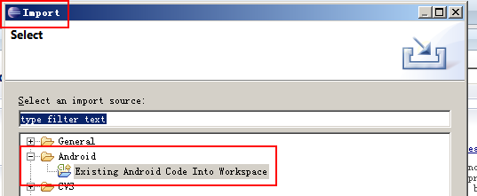
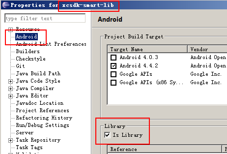
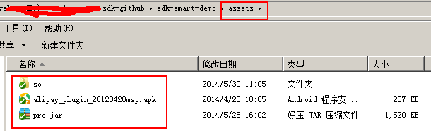

This is the Xiaocong SDK.

## Feature

* Xiaocong advertisement and pushing service.
* Xiaocong User/Account system service.
* Xiaocong Payment SDK.

> Tip
* Our SDK is designed for TVs, which have higher resolution than mobile phones. We expect the resolution 1280px * 960px at least.
* Almost all android TVs in the market carry Android 4.0+. So we need `minSdkVersion > 14` .
* JDK 1.6+ required.

## Quick Start

We provide you with an Eclipse Android Library Project.

[0] Git clone this project to your disk. Import it into your Eclipse.

If you inspect the properties of the project, you could find out that this project is an Android library project.

[1] Make this project as your project's dependency project. Open your properties of your project, go to `Android -> Library`:

[2] Copy all `assets` files from Demo project to the `assets` of you project.

## Change Logs

### Version 0.9.1

2014-05-28
Improve payemnt flow; Support 360 payment.

1. The payment flows have been improved. `PaymentStartActivity` and `PayWayActivity` are merged into a single activity `PaymentActivity_`.
1. The Payment Test DEMO has been simplified. You could start the payment test with a single button.
1. We now take care of checking user account when needed. You don't need to care for user authenciation any more. Refreshing the accessTokens automatically is also supported inside payment SDK now.
1. The payment result set has been polished. Please refer to the doc.

Sorry for some imcompatible changes.

### Version 1.0.0

Improve UI; Fix some bugs; Support small screen.

### Version 1.1.0

Required JDK 1.7 => 1.6.

