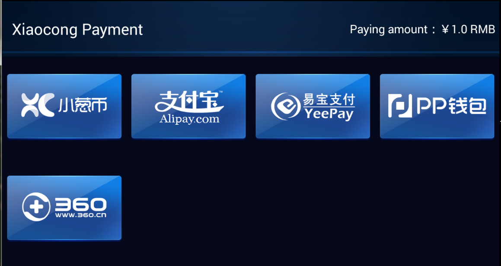
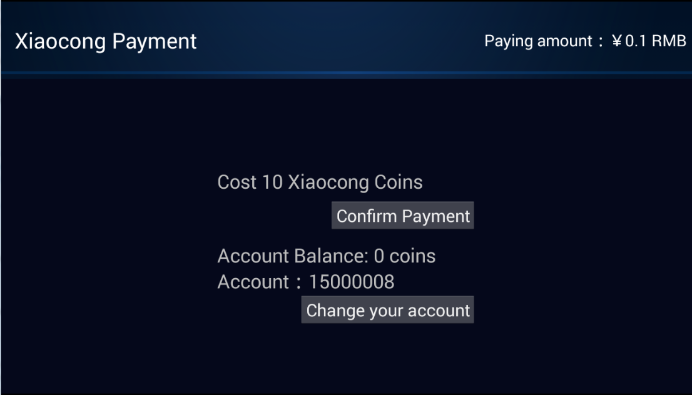
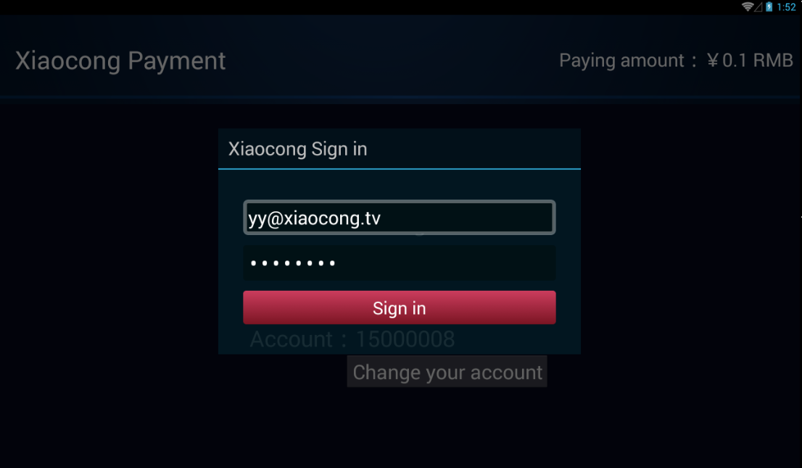
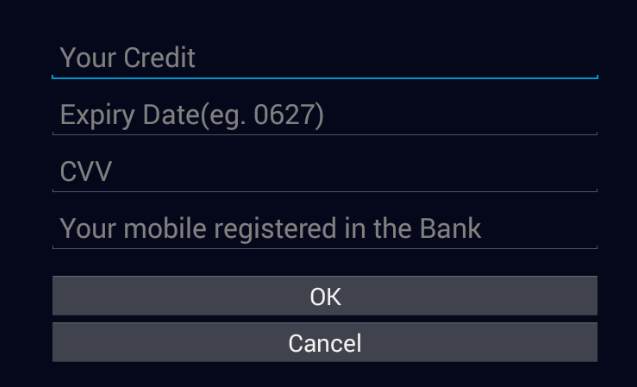
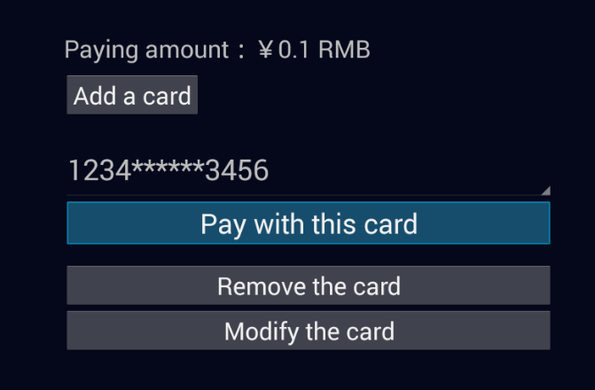

# Payment Development Guide

[toc]

<a name="appply_for_account" ></a>
## Developer Identity

You need apply for an developer identity first. The `partnerId`and MD5/RSA key are used to encrypt the communication. The `client_id` and `client_secret` are used by Oauth 2 protocol.

In demo project, these parameters are constants in `tv.xiaocong.sdk.demo.Keys`.

## How to run the demo

The SDK is an Android Library project. Download: https://github.com/XiaoCongGame/sdk-smart-lib。

The Demo is an Android project. Download: https://github.com/XiaoCongGame/sdk-smart-demo。

Download two projects and import them into Eclipse. The Demo project depends on the SDK project. Fix the denpendency error in Eclipse if you find one.

The demo project has been simplified to work with. Now you don't need any adjustment. The demo could be run and tested immediately.

## Payment service providers

Now we support the following payment service providers in China:

- Xiaocong coins
- Alipay
- Yee Pay
- PP
- 360 coins



### Xiaocong Coins

The following is the screen for Xiaocong coins.

Users will know how many coins they will pay, the account balance, and the account ID. They could **change the account** to pay, if, for example, the current account don't have enough coins.



The signin dialog will show up if

- Users is going to change the account to pay
- The signin session expire.



If you don't want users to change their accounts, you need pass the accessToken to us(See `tv.xiaocong.sdk.demo.XcPayUtils`).

### Yeepay

If the user use this provider first time, a screen that collects all information for payment will show up as following:



The card information will be persistent. So next time you use this provider, there're be a list of cards from which you could select one, instead of typing again.



## Using the SDK

Please first read codes of the Demo project.

When you ask user to pay for something, make your app into our payment `Activity`. The entrance of payment service is `PaymentHelper.startMe`. After payment, you caller `Activity` will receive the result.

```java
    /**
     * Execute payment.
     * 
     * @param caller
     *            (Required) the activity that starts {@link PaymentStartActivity}.
     * @param partnerId
     *            (Required)
     * @param amount
     *            (Required) the money to pay. The unit is RMB cent. (1 Xiaocong coin == 1 RMB
     *            cent.)
     * @param signType
     *            (Required) md5 or RSA
     * @param orderNo
     *            (Required) the order number in your system. Should be unique for all your request.
     *            Prefixed by your partnerId. Format: ^{12,30}$.
     * @param pkgname
     *            (Required) the package name of you application
     * @param goodsDes
     *            (Required) some descriptions about your goods
     * @param signature
     *            (Required) the request signature. For the format of the signature, refer to
     *            {@link MainActivity#getSign(int, int, String, String, String)}.
     * @param notifyUrl
     *            (Required) the callback URL in your server.
     * @param remark
     *            (Optional) some remark for this order
     * @param accessToken
     *            (Optional) If you don't want users to change their account, provide a accessToken
     *            yourself; If you pass null, then we'll pop up login dialog to get the accessToken
     *            if necessary.
     */
    public static void pay(Activity caller, int partnerId, int amount, String signType,
            String orderNo, String pkgname, String goodsDes, String signature, String notifyUrl,
            String remark, String accessToken) {
        PaymentHelper.startMe(caller, partnerId, amount, signType, orderNo, pkgname, goodsDes,
                signature, notifyUrl, remark, Keys.CLIENT_ID, Keys.CLIENT_SECRET, accessToken);
    }
```

The possible payment results are list in `com.xiaocong.sdk.PaymentResults`.

- `ILLEGAL_PARAMETER`: Your request(ie. calling `pay`) is invalid.
- `NO_PAY_WAY`: No payment service providers available.
- `PAYRESULT_OK`: Success
- `PAYRESULT_FAIL`: Fail for sure
- `CANCEL_BUY`: You cancel the payemnt finally.
- `CREATE_ORDER_FAIL`: Failed to create the order in Xiaocong.
- `DUPLICATE_ORDER_NO`: Your submitted order no is duplicate in our system. If you get this error, please check your generation mechanism of order no.
- `PAYRESULT_PENDING`: The result is pending, please wait for your server to be notified.

## Notify your server the result

Finally you server will be notified the result. The result will be `POST`ed to your server. The http body carrys with the following parameters(in `x-www-form-urlencoded`):

```
orderNo=2013041510251288&amount=10&account=13218181&notifyTime=12365212352&goodsDes=sword&status=1&sign=ZPZULntRpJwFmGNIVKwjLEF2Tze7bqs60rxQ22CqT5J1UlvGo575QK9z/+p+7E9cOoRoWzqR6xHZ6WVv3dloyGKDR0btvrdq PgUAoeaX/YOWzTh00vwcQ+HBtXE+vPTfAqjCTxiiSJEOY7ATCF1q7iP3sfQxhS0nDUug1LP3OLk&mark=testcontent
```

- `orderNo`: the order number you sent to us at the beginning
- `amount`: the paying unit is RMB cent
- `account`: the xiaocong account of the user
- `sign`: the signature of the request. [The format](https://github.com/XiaoCongGame/xcPay_notify_demo/blob/master/src/main/webapp/notify.jsp).
- `notifyTime`：a long integer
- `goodsDes`：the goods description you sent to us before
- `status`: `1` for success; `2` for failure
- `mark`: the remark you sent to us

The response of the notification should be a single word in HTTP response body.

- `success`: you got the result
- `fail`: any exceptions
- `sign_fail`: for invalid signature

After processing the order, we will do callback immediately. If it's failed we will call again every three minutes. But we won't call forever. The callback will give up after 24 hours.

## Query for the order

Using following API to query the order from our server.

```
http://data.xiaocong.tv/queryOrderInfo.action?orderNo=2013041510251288&version=2&sign=b4600ae75b27f5fe1fb213f6e6d9620a
```

The http query parameter:

- `orderNo` [String]：The order number in your system, which is identical with the parameter `orderNo` of `XcPayUtils.pay`.
- `version` [int]：Always be `2`。
- `sign` [String]：The signature, which is identical with the parameter `signature` of `XcPayUtils.pay`.

The reponse is plain text, like `Code~Message`. For example, for successful payment, the response is `200~Success`.

The full list of response text:
- `200~Success`: success
- `512~Order payment failure`: payment failure
- `210~Order processing`: processing
- `509~Order not exists`: the order isn't existed
- `400~Version number error`: invalid `version`
- `400~Order number is request`: `orderNo` is missing
- `400~Sign is request`: `sign` is missing
- `401~Sign verification failed`: invalid `sign`

