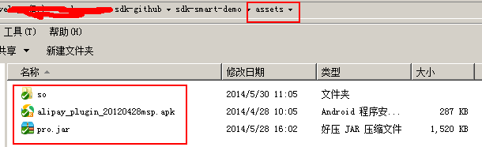

We provide you with an Eclipse Android Library Project.

[0] Git clone this project to your disk. Import it into your Eclipse.

If you inspect the properties of the project, you could find out that this project is an Android library project.

[1] Make this project as your project's dependency project. Open your properties of your project, go to `Android -> Library`:

[2] Copy all `assets` files from [Demo project](https://github.com/XiaoCongGame/sdk-smart-demo) to the `assets` of you project.

