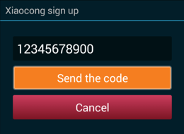
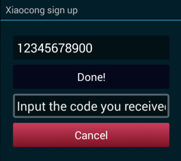
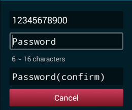
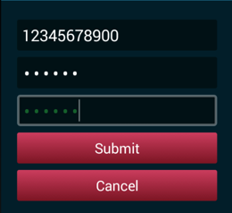

[toc]

## Register/Sign up

Users could register a new Xiaocong account by SDK.

The flow:

1. Users must provide with their mobile number. The mobile must have **11 digtals**.
	
1. A code will be sent to user's mobile after uses trigger 'Send the code'. **One minute later**, users could trigger sending again.
	
1. Fill in the code to verify the mobile.
	
1. Input the password twice. The length of passwords must be **between 6 and 16**. Only letters and digitals are allowed.
	
1. Submit the request.
	
1. If the mobile has existed, the request will fail.

## Sign in/Login in

Users could sign in by their usernames/email/mobile.

The backend system is powered by Oauth 2.0. You'll get a `access_token` after signing up.


In the callback of your activity, you could find the accessToken and username from the Intent.

```
protected void onActivityResult(int requestCode, int resultCode, Intent data) {
	super.onActivityResult(requestCode, resultCode, data);
    if (requestCode == REQUEST_CODE_LOGIN && resultCode == RESULT_OK && data != null) {
        String accessToken = data.getStringExtra(LoginActivity.RESPONSE_ACCESS_TOKEN);
        String username = data.getStringExtra(LoginActivity.USERNAME);

        String toast = String.format("access_token: %s, username: %s", accessToken, username);
        Toast.makeText(this, toast, Toast.LENGTH_LONG).show();
    }
    ...
```

The username and accessToken will be stored in `SharedPreferences` after sign-in. You could call `tv.xiaocong.sdk.security.LoginActivity.getSecurePreferences(Context)` to get the `SharedPreferences`. You could use the keys `tv.xiaocong.sdk.security.LoginActivity.RESPONSE_ACCESS_TOKEN`, `tv.xiaocong.sdk.security.LoginActivity.RESPONSE_REFRESH_TOKEN`, `tv.xiaocong.sdk.security.LoginActivity.USERNAME` to fecth the AccessToken, RefreshToken and the username.

