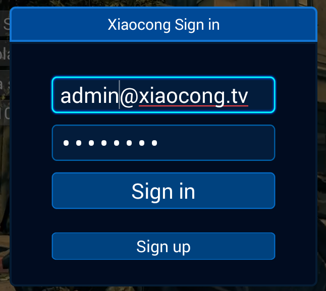

[toc]

## Register/Sign up

Users could register a new Xiaocong account by SDK.

The flow:

1. Users must provide with their mobile number. The mobile must have **11 digtals**.  
	
1. A code will be sent to user's mobile after uses trigger 'Send the code'. **One minute later**, users could trigger sending again.  
	
1. Fill in the code to verify the mobile.  
	
1. Input the password twice. The length of passwords must be **between 6 and 16**. Only letters and digitals are allowed.  
	
1. Submit the request.  
	
1. If the mobile has existed, the request will fail.

## Sign in/Login in

Users could sign in by their usernames/email/mobile.

The backend system is powered by Oauth 2.0. You'll get a `access_token` after signing up.

