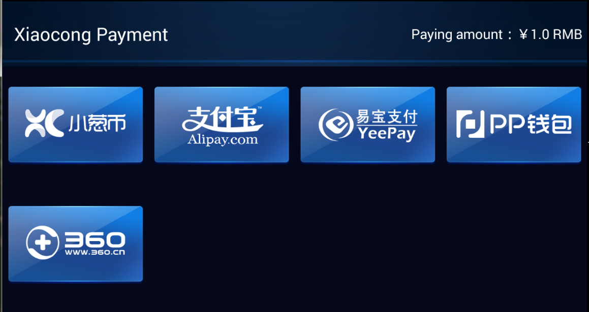

# 支付开发指南

[toc]

<a name="appply_for_account" ></a>
## 开发者账户

与小葱支付服务器交互，需要使用MD5或RSA加密数据。为此，需要申请开发者标识（`partnerId`）和MD5、RSA密钥。

当使用小葱币支付时，需要用户使用小葱 *OAuth 2* 登录。使用OAuth2需要申请`client_id`/`client_secret`。

## 如何运行DEMO

SDK 以 Android Library 工程的形式提供。下载地址：https://github.com/XiaoCongGame/sdk-smart-lib。

Demo工程下载：https://github.com/XiaoCongGame/sdk-smart-demo。

将两个工程下载后，导入Eclipse。配置Demo工程依赖SDK工程。运行Demo工程即可。

## 可用的支付方式

目前我们支持以下支付方式：

- 小葱币
- 支付宝
- 易宝
- PP（信用）支付
- 360币



## 使用SDK

请参见Demo工程的代码。

开发者ID、密钥统一放在`tv.xiaocong.sdk.demo.Keys`。可以替换为您的正式账户和密钥。

支付的进入点是`PaymentHelper.startMe`：

```java
    /**
     * Execute payment.
     * 
     * @param caller
     *            (Required) the activity that starts {@link PaymentStartActivity}.
     * @param partnerId
     *            (Required)
     * @param amount
     *            (Required) the money to pay. The unit is RMB cent. (1 Xiaocong coin == 1 RMB
     *            cent.)
     * @param signType
     *            (Required) md5 or RSA
     * @param orderNo
     *            (Required) the order number in your system. Should be unique for all your request.
     *            Prefixed by your partnerId. Format: ^{12,30}$.
     * @param pkgname
     *            (Required) the package name of you application
     * @param goodsDes
     *            (Required) some descriptions about your goods
     * @param signature
     *            (Required) the request signature. For the format of the signature, refer to
     *            {@link MainActivity#getSign(int, int, String, String, String)}.
     * @param notifyUrl
     *            (Required) the callback URL in your server.
     * @param remark
     *            (Optional) some remark for this order
     */
    public static void pay(Activity caller, int partnerId, int amount, String signType,
            String orderNo, String pkgname, String goodsDes, String signature, String notifyUrl,
            String remark) {
        PaymentHelper.startMe(caller, partnerId, amount, signType, orderNo, pkgname, goodsDes,
                signature, notifyUrl, remark, Keys.CLIENT_ID, Keys.CLIENT_SECRET);
    }
```

所有可能的支付结果列在`com.xiaocong.sdk.PaymentResults`。

- `ILLEGAL_PARAMETER`: Your request(ie. calling `pay`) is invalid.
- `NO_PAY_WAY`: 没有可用的支付方式。请联系商务人员检查签约时约定的支付方式。
- `PAYRESULT_OK`: 支付成功。
- `PAYRESULT_FAIL`: 支付失败。
- `CANCEL_BUY`: 用户取消支付。
- `CREATE_ORDER_FAIL`: 不能在小葱支付系统内创建定单。
- `PAYRESULT_PENDING`: 支付结果不确定。请等待服务器回调。

## 服务器回调

最终您的游戏服务器会收到我们的回调。形如：
```
http://notify.java.jpxx.org/notify.jsp?orderNo=2013041510251288&amount=10&account=13218181&notifyTime=12365212352&goodsDes=sword&status=1&sign=ZPZULntRpJwFmGNIVKwjLEF2Tze7bqs60rxQ22CqT5J1UlvGo575QK9z/+p+7E9cOoRoWzqR6xHZ6WVv3dloyGKDR0btvrdq PgUAoeaX/YOWzTh00vwcQ+HBtXE+vPTfAqjCTxiiSJEOY7ATCF1q7iP3sfQxhS0nDUug1LP3OLk&mark=testcontent
```

回调中HTTP查询参数是：

- `orderNo`: 您给我们的订单号
- `amount`: 单位为分
- `account`: 用户小葱号
- `sign`: 请求签名。签名格式参见https://github.com/XiaoCongGame/xcPay_notify_demo/blob/master/src/main/webapp/notify.jsp。
- `notifyTime`：回调时间，一个长整数。
- `goodsDes`：您在支付时传来的商品描述。
- `status`: `1`表示成功；`2`表示失败。
- `mark`: 您在支付时传来的备注。

当收到我们的回调后，您可以给出以下响应，在HTTP响应Body中显示以下几个简单的字符：

- `success`: you got the result
- `fail`: any exceptions
- `sign_fail`: for invalid signature

## 查询订单

可以通过以下URL查询订单：
```
http://data.xiaocong.tv/queryOrderInfo.action?orderNo=2013041510251288&version=2&sign=b4600ae75b27f5fe1fb213f6e6d9620a
```

Http请求参数：

- `orderNo` [String]：The order number in your system, which is identical with the parameter `orderNo` of `XcPayUtils.pay`.
- `version` [int]：Always be `2`。
- `sign` [String]：The signature, which is identical with the parameter `signature` of `XcPayUtils.pay`.

The reponse is plain text, like `Code~Message`. For example, for successful payment, the response is `200~Success`.

The full list of response text:
- `200~Success`: success
- `512~Order payment failure`: payment failure
- `210~Order processing`: processing
- `509~Order not exists`: the order isn't existed
- `400~Version number error`: invalid `version`
- `400~Order number is request`: `orderNo` is missing
- `400~Sign is request`: `sign` is missing
- `401~Sign verification failed`: invalid `sign`

