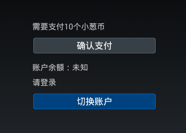

# 支付开发指南

[toc]

## 开发者账户

请先申请AppId和AppKey。

## 如何运行DEMO

参见[快速入手](quick-start.md)。

SDK 以 Android Library 工程的形式提供。

[SDK下载](https://github.com/XiaoCongGame/sdk-smart-lib)

[Demo下载](https://github.com/XiaoCongGame/sdk-smart-demo)

将两个工程下载后，导入Eclipse。配置Demo工程依赖SDK工程。运行Demo工程即可。

## 可用的支付方式

可用的支付方式是服务端控制的，可以改变，由双方公司商务协商确定。目前可用的支付方式包括：小葱币、支付宝快捷支付、易宝信用卡支付、盛付通支付、360支付。


### 小葱币

下面是小葱币的支付界面。界面将显示本次需要支付的小葱币数量，当前账户余额与账户ID。用户可以选择更换支付账户——如果——例如，当前账户余额不足。



如果检测到用户已登录，且登录未过期，则将直接使用存在的账户。否则，在此界面可能弹出登录对话框：

- 如果用户选择更换账户
- 如果之前登录的账户过期。


如果你不想让用户切换账户，例如，你向让用户用已登录过的小葱账户支付，则你需要传给我们之前登录时获得的`accessToken`。

## 使用SDK

强烈建议阅读理解Demo的代码后再进行接入。Demo非常简短明了。Demo配置好后可直接运行。

AppId/AppKey、应用包名、回调地址配置在`tv.xiaocong.sdk.demo.Keys`。正式上线前请替换成正式的内容。

> 风险警示：实际项目中，密钥不建议以明文形式放在Java源代码或配置文件中。建议放在服务器上，并通过加密通信获取。至少，应该编译到so库中，增加破解难度。

## 支付的客户端回调

支付完成后界面会接收到回调（参见Demo代码）。所有可能的支付结果列在`com.xiaocong.sdk.PaymentResults`。

- `ILLEGAL_PARAMETER`: Your request(ie. calling `pay`) is invalid.
- `NO_PAY_WAY`: 没有可用的支付方式。请联系商务人员检查签约时约定的支付方式。
- `PAYRESULT_OK`: 支付成功。
- `PAYRESULT_FAIL`: 支付失败。
- `CANCEL_BUY`: 用户取消支付。
- `CREATE_ORDER_FAIL`: 不能在小葱支付系统内创建定单。
- `DUPLICATE_ORDER_NO`：订单号重复。如果遇到这个错误，请检查你的订单号生成逻辑，可能有BUG。
- `PAYRESULT_PENDING`: 支付结果不确定。请等待服务器回调。
- `PAYRESULT_FAIL_NET`：网络错误，网络未连接或中断

## 支付的服务器回调

最终您的游戏服务器会收到我们的回调。回调以POST发出。参数在HTTP Body中。格式编码为`x-www-form-urlencoded`。携带以下参数：

	orderNo=2013041510251288&amount=10&account=13218181&notifyTime=12365212352&goodsDes=sword&status=1&sign=ZPZULntRpJwFmGNIVKwjLEF2Tze7bqs60rxQ22CqT5J1UlvGo575QK9z/+p+7E9cOoRoWzqR6xHZ6WVv3dloyGKDR0btvrdq PgUAoeaX/YOWzTh00vwcQ+HBtXE+vPTfAqjCTxiiSJEOY7ATCF1q7iP3sfQxhS0nDUug1LP3OLk&mark=testcontent

参数解释：

- `orderNo`: 您给我们的订单号
- `amount`: 单位为分
- `account`: 用户小葱号
- `sign`: 请求签名。签名格式参见[notify.jsp](https://github.com/XiaoCongGame/xcPay_notify_demo/blob/master/src/main/webapp/notify.jsp)。
- `notifyTime`：回调时间，一个长整数。
- `goodsDes`：您在支付时传来的商品描述。
- `status`: `1`表示成功；`2`表示失败。
- `mark`: 您在支付时传来的备注。

当收到我们的回调后，您可以给出以下响应，在HTTP响应Body中显示以下几个简单的字符：

- `success`: you got the result
- `fail`: any exceptions
- `sign_fail`: for invalid signature

在收到订单并处理完后，服务器会立即回调。如果回调失败（如你们的服务器没开），会隔3分钟左右再次回调。若24小时内都不能回调成功，将不再回调。

> 多数情况下，不需要依赖回调。如果客户端显式返回成功，则订单最终一定会成功。只有客户端返回状态未决时（`PAYRESULT_PENDING`），才需要根据回调确定结果。

## 查询订单

可以通过以下URL查询订单：
```
http://data.xiaocong.tv/queryOrderInfo.action?orderNo=2013041510251288&version=2&sign=b4600ae75b27f5fe1fb213f6e6d9620a
```

Http请求参数：

- `orderNo` [String]：The order number in your system, which is identical with the parameter `orderNo` of `XcPayUtils.pay`.
- `version` [int]：Always be `2`。
- `sign` [String]：The signature, which is identical with the parameter `signature` of `XcPayUtils.pay`.

The reponse is plain text, like `Code~Message`. For example, for successful payment, the response is `200~Success`.

The full list of response text:
- `200~Success`: success
- `512~Order payment failure`: payment failure
- `210~Order processing`: processing
- `509~Order not exists`: the order isn't existed
- `400~Version number error`: invalid `version`
- `400~Order number is request`: `orderNo` is missing
- `400~Sign is request`: `sign` is missing
- `401~Sign verification failed`: invalid `sign`

