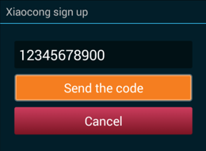
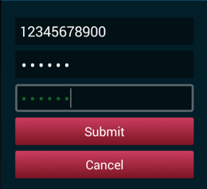

[toc]

## 注册

用户可以使用SDK注册一个新的小葱号。流程如下：

1、用户只能用手机号注册。用手机号做用户名。


2、 需要验证发送到手机上的验证码。

 

3、输入两次密码。密码长度为6到16个字母或数字。


4、提交请求



## 登录

用户使用用户名登录。用户名可以是手机号、邮箱、小葱号（取决于用户注册时使用的设备）。


登陆可以参见Demo的`tv.xiaocong.sdk.demo.MainActivity.login(View)`方法。

```java
    public void login(View view) {
        Intent loginIntent = new Intent(this, LoginActivity.class);
        // MUST be string !!!!!
        loginIntent.putExtra("client_id", String.valueOf(Keys.APP_ID));
        loginIntent.putExtra("client_secret", Keys.APP_KEY);
        loginIntent.putExtra("usingCache", true); // 记住登录

        startActivityForResult(loginIntent, REQUEST_CODE_LOGIN);
    }
```

其中，第三个extra是关键的。

- 如果usingCache为false，表示强制登陆，即一定会弹出登陆对话框，让用户点击登陆，获取新的token，不管之前是否成功登陆过。
- 如果usingCache为true，会先检查本地是否有access token。如果有，校验此token的有效性，若有效，或虽过期但刷新后仍有效，会直接结束登陆Activity，`onActivityResult`给出结果。否则，则必须让用户重新触发登陆操作，获取新的token。

不论哪种方式，登陆结果都在`onActivityResult`中获取。首先通过`resultCode`判断生否成功拿到token（`RESULT_OK`）。若是，可以通过下面的方式分布拿到OAuth2的access token/refresh token和username（用户唯一标示）。

```
protected void onActivityResult(int requestCode, int resultCode, Intent data) {
	super.onActivityResult(requestCode, resultCode, data);
    if (requestCode == REQUEST_CODE_LOGIN && resultCode == RESULT_OK && data != null) {
        String accessToken = data.getStringExtra(LoginActivity.RESPONSE_ACCESS_TOKEN);
        String refreshoken = data.getStringExtra(LoginActivity.RESPONSE_REFRESH_TOKEN);
        String username = data.getStringExtra(LoginActivity.USERNAME);

        String toast = String.format("access_token: %s, username: %s", accessToken, username);
        Toast.makeText(this, toast, Toast.LENGTH_LONG).show();
    }
    ...
```

此外，登录成功后，用户名和AccessToken存储在`SharedPreferences`中。可以通过`LoginActivity.getSecurePreferences(Context)`获取到这个`SharedPreferences`。然后利用`LoginActivity.RESPONSE_ACCESS_TOKEN`、`LoginActivity.RESPONSE_REFRESH_TOKEN`、`LoginActivity.USERNAME`三个键，可以分别取到缓存的AccessToken、RefreshToken和用户名。

通过以下方法可以判断access token是否有效：

    tv.xiaocong.sdk.XcServiceClient.isAccessTokenValid(String)

如果想刷新token，可以调用：
    
    Oauth2Tokens tv.xiaocong.sdk.XcServiceClient.refreshOauth2(String clientId, String clientSecret, String refreshToken)
    
> 上述两个方法都涉及网络，因此需要在后台线程中调用。不推荐直接使用这些方法，建议统一走一次登陆流程。取`onActivityResult`中的结果。


    
